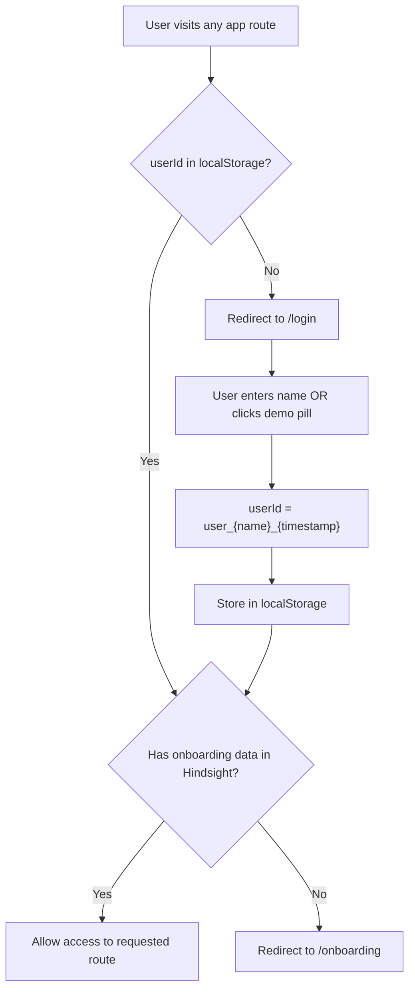
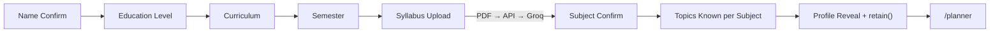
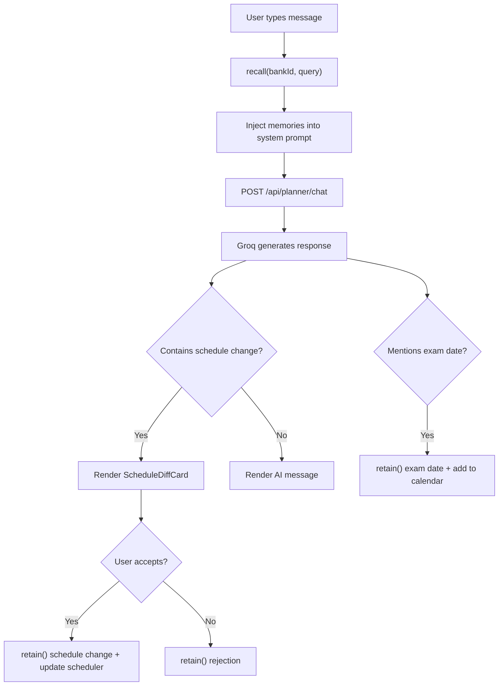
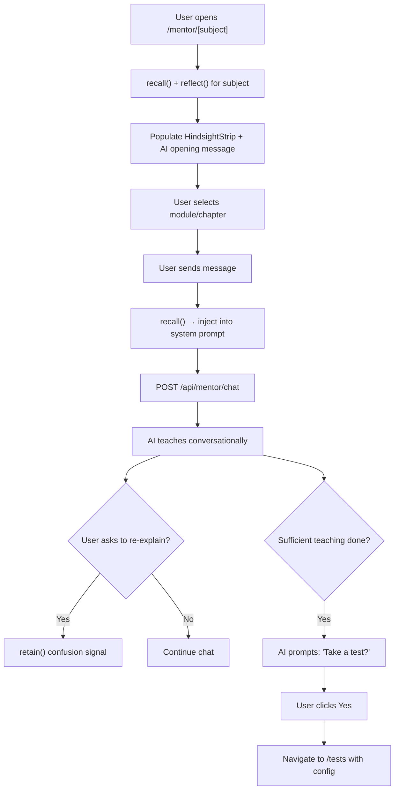
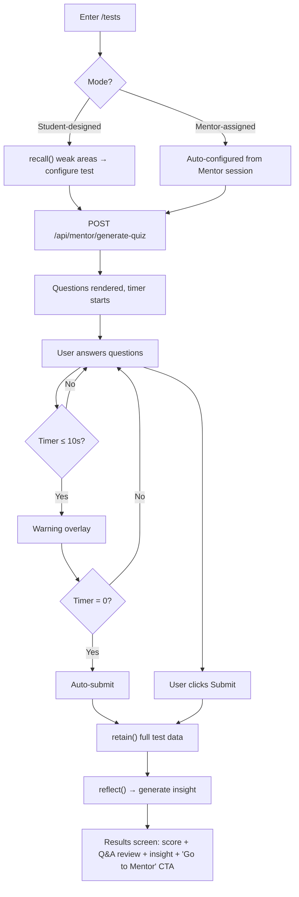

# Recallio — Complete Application Architecture & Implementation Plan

> **Source of truth:** [CONTEXT_DOC.MD](file:///C:/Users/Aaryan/Downloads/Sage-1/CONTEXT/CONTEXT_DOC.MD) for features, [DESIGN_SYSTEM.MD](file:///C:/Users/Aaryan/Downloads/Sage-1/CONTEXT/DESIGN_SYSTEM.MD) for all styling.
> **Existing codebase:** Landing page at `/` (16 components in `components/landing/`), 57 shadcn/ui primitives, Next.js 16 + React 19 + Tailwind CSS v4. No app routes beyond `/` exist.

---

## STEP 2 — Page Mapping

### Route 1: `/` — Landing Page

| Field | Detail |
|---|---|
| **Purpose** | Marketing landing page with hero, features, pricing, testimonials, and a single CTA to `/login`. |
| **User types** | Anonymous visitors |
| **Entry points** | Direct URL, search engines |
| **Components** | `Navigation`, `HeroSection`, `FeaturesSection`, `HowItWorksSection`, `MetricsSection`, `IntegrationsSection`, `InfrastructureSection`, `SecuritySection`, `DevelopersSection`, `TestimonialsSection`, `PricingSection`, `CtaSection`, `FooterSection`, `AnimatedSphere`, `AnimatedTetrahedron`, `AnimatedWave` |
| **State & data** | None (static) |
| **Key interactions** | CTA button → navigates to `/login` |

> [!NOTE]
> Already built. Do not touch or rework.

---

### Route 2: `/login` — Mock Login

| Field | Detail |
|---|---|
| **Purpose** | Name input screen with two pre-seeded demo user pills (Aryan, Priya). Sets localStorage userId and routes user. |
| **User types** | All users |
| **Entry points** | Landing page CTA, direct URL, redirect from protected routes |
| **Components** | `LoginCard` (full-screen centered), `NameInput`, `DemoUserPill` ×2, `SubmitButton` |
| **State & data** | **Writes:** `localStorage.recallio_userId` = `user_${name.toLowerCase()}_${Date.now()}`. **Reads:** Hindsight (via API) to check if onboarding is complete for this userId. |
| **Key interactions** | 1. User types name OR clicks demo pill → sets userId. 2. Check Hindsight for onboarding data → if exists → redirect `/planner`, else → redirect `/onboarding`. |

---

### Route 3: `/onboarding` — 8-Step Onboarding Flow

| Field | Detail |
|---|---|
| **Purpose** | Collect student profile data in a Duolingo-style one-step-at-a-time UX. Culminates in Profile Reveal and `retain()` call. |
| **User types** | New users (no existing Hindsight memory) |
| **Entry points** | Redirect from `/login` for new users |
| **Components** | `OnboardingShell` (full-screen, progress bar), `StepNameConfirm`, `StepEducationLevel` (4 tap cards), `StepCurriculum` (dynamic cards based on step 2), `StepSemester` (tap cards), `StepSyllabusUpload` (drag-drop zone + template pills + processing animation), `StepSubjectConfirm` (staggered animated subject cards with toggle), `StepTopicsKnown` (per-subject pill selects with "Subject X of Y" progress), `StepProfileReveal` (animated proficiency bars + weak area badges + CTA), `TapCard` (reusable selection card), `ProgressBar`, `PillSelect` |
| **State & data** | **Local state:** `currentStep`, `name`, `educationLevel`, `curriculum`, `semester`, `syllabusFile`, `parsedSubjects[]`, `confirmedSubjects[]`, `knownTopics{}`, `baselineProficiency{}`. **API calls:** POST `/api/onboarding/parse-syllabus` (step 5), POST `/api/memory/retain` (step 8). |
| **Key interactions** | Step 1: tap "Let's Go" → advance. Steps 2-4: tap card → auto-advance (150ms violet glow animation). Step 5: drag-drop PDF or pick template → processing spinner → subjects extracted. Step 6: confirm/deselect subjects → advance. Step 7: per-subject pill select for known topics, "Skip" option. Step 8: animated bars fill from 0% → baseline, weak area badges appear, `retain()` fires with full profile, CTA → `/planner`. |

---

### Route 4: `/planner` — Chat + Calendar + Scheduler (Default Post-Login)

| Field | Detail |
|---|---|
| **Purpose** | The command centre. Claude.ai-style chat where students manage their study schedule, powered by Hindsight memory. |
| **User types** | Authenticated returning users |
| **Entry points** | Post-login redirect (default), sidebar navigation |
| **Components** | `AppSidebar` (shared), `DailyBriefingCard` (streak, greeting, last subject, upcoming exam, weakest topic — dismissible), `PlannerChat` (message list + input + quick-action chips), `ChatMessage` (AI or user bubble), `QuickActionChip` ×4 ("Plan my week", "I have an exam coming up", "What should I study today?", "Quiz me"), `SchedulerPanel` (today's tasks: subject, topic, time, mode — clickable → `/mentor/[subject]`), `CalendarPanel` (monthly mini-cal: red=exams, green=completed, blue=scheduled), `ScheduleDiffCard` (AI-proposed schedule change with Accept/Reject) |
| **State & data** | **On mount:** `recall()` + `reflect()` → daily briefing data. **Per message:** `recall()` → inject memory context into system prompt → POST `/api/planner/chat`. **Writes:** `retain()` on exam dates mentioned, preferences, schedule accepts/rejects. **Local state:** `messages[]`, `schedule[]`, `calendarEvents[]`, `isBriefingDismissed`. |
| **Key interactions** | 1. Daily briefing card renders on return visit (powered by recall+reflect). 2. Chat sends message → recall → Groq → AI response (possibly with schedule diff). 3. Quick-action chips pre-fill chat input. 4. Schedule diff card → Accept/Reject → animation → retain(). 5. Click scheduler task → navigate to `/mentor/[subject]?topic=X`. 6. Click calendar date → expand day view inline. |

---

### Route 5: `/mentor` — Subject Grid

| Field | Detail |
|---|---|
| **Purpose** | Notion-style card grid showing all subjects. Gateway to the 3-panel study interface. |
| **User types** | Authenticated users |
| **Entry points** | Sidebar navigation |
| **Components** | `AppSidebar` (shared), `SubjectCard` (cover image, subject name, chapter count badge, last studied date, proficiency % bar, hover overlay: "62% proficiency · 3 weak topics") |
| **State & data** | **Reads:** User profile from localStorage/context (subjects, proficiency data, last studied dates). `recall()` per subject for weak topics on hover. |
| **Key interactions** | Click subject card → navigate to `/mentor/[subject]`. Hover → fade-in overlay with proficiency and weak topic count. |

---

### Route 6: `/mentor/[subject]` — 3-Panel Study Interface

| Field | Detail |
|---|---|
| **Purpose** | Where actual studying happens. NotebookLM-inspired 3-panel layout: Sources · Chat · Studio. AI teaching is personalised via Hindsight. |
| **User types** | Authenticated users studying a subject |
| **Entry points** | `/mentor` grid click, `/planner` scheduler task click (with `?topic=X` pre-loaded) |
| **Components** | `AppSidebar` (shared), **Left panel — Sources:** `SourcesList` (uploaded PDFs), `AddSourceButton`, `HindsightHistoryStrip` (last studied, weak areas, score trend). **Centre panel — Chat:** `ModuleDropdown` (chapter/topic selector), `HindsightStrip` (inline — last studied, weak, score trend), `MentorChat` (message list + input), `ChatMessage`. **Right panel — Studio:** `FlashcardsWidget` (✅ working — key/def pairs), `SummaryWidget` (✅ working), `MindMapWidget` (🔲 placeholder), `SlideDeckWidget` (🔲 placeholder), `QuizLaunchButton` (✅ working → navigates to `/tests`), `PomodoroTimer` (25min / short / long break + post-session check-in modal: Great / Mixed / Struggled). |
| **State & data** | **On mount:** `recall()` + `reflect()` for this subject → history strip + AI opening message. **Per message:** `recall()` → system prompt → POST `/api/mentor/chat`. **Writes:** `retain()` on re-explain signals (confusion detection), session end (topics covered), Pomodoro check-in response. **API calls:** `/api/mentor/flashcards`, `/api/mentor/summary`, `/api/mentor/generate-quiz`. **Local state:** `selectedModule`, `messages[]`, `pomodoroState`, `flashcards[]`, `summary`. |
| **Key interactions** | 1. Module dropdown selects topic. 2. Chat with memory-backed AI tutor. 3. Re-explain detection → retain(). 4. Studio: Flashcards/Summary generate on click. Quiz button → /tests with pre-config. 5. Pomodoro: Start → countdown → completion check-in modal → retain(). 6. AI prompts "Would you like to take a test?" → bridges to Tests. |

---

### Route 7: `/tests` — MCQ Test Interface

| Field | Detail |
|---|---|
| **Purpose** | Focused MCQ quiz interface. Two modes: student-designed (pick subject/topic/count/time) and Mentor-assigned (auto-configured). |
| **User types** | Authenticated users taking a quiz |
| **Entry points** | Sidebar navigation, Mentor Studio "Quiz" button, Mentor AI prompt |
| **Components** | `AppSidebar` (shared), **Mode selection (if student-designed):** `TestConfigPanel` (subject select, module/topic select, question count slider 5–20, time limit input). **Test UI:** `TestHeader` (timer countdown, subject name, submit button), `QuestionCard` (question text + 4 option tiles in 2×2 grid), `QuestionPillNav` (numbered pills 1–N, jump to any, color-coded: answered/unanswered/current), `TimeWarningOverlay` (10-second warning). **Results:** `ResultsScreen` (score display, correct/incorrect breakdown, per-question review with correct answer highlighted, `reflect()` AI insight, "Go to Mentor" CTA + "Skip"). |
| **State & data** | **On mount (student-designed):** `recall()` → check past mistakes → bias question generation toward weak areas. **Generate:** POST `/api/mentor/generate-quiz` or `/api/onboarding/generate-test`. **Writes:** `retain()` with full test data (all Q&As, score, time per Q, total time, mode, subject, date) on submit. `reflect()` fires on results screen for insight. **Local state:** `mode`, `config`, `questions[]`, `answers{}`, `currentQ`, `timeRemaining`, `isSubmitted`, `results`. |
| **Key interactions** | 1. Mode selection → Student: configure, Mentor: auto. 2. Timer starts. 3. Click option tile → select answer (changeable). 4. Pill nav → jump to any question. 5. 10s warning overlay. 6. Timer zero → auto-submit. 7. Results: per-Q review, reflect() insight, "Go to Mentor" CTA. 8. retain() fires on submission. |

---

### Route 8: `/profile` — Analytics + Test History

| Field | Detail |
|---|---|
| **Purpose** | Student analytics dashboard showing proficiency per subject (with `reflect()` qualitative insights), test history, streak, XP, and link to Memory Panel. |
| **User types** | Authenticated users |
| **Entry points** | Sidebar navigation |
| **Components** | `AppSidebar` (shared), `ProfileHeader` (name, education level, streak counter 🔥, XP ⚡), `ProficiencyBar` ×N (per-subject: animated fill bar + percentage + phase label + `reflect()` qualitative insight below), `TestHistoryList` (date, subject, score, time — each row clickable → full Q&A review), `ViewMemoryButton` ("🧠 View My Memory" → opens Memory Panel). |
| **State & data** | **On mount:** `reflect()` per subject for qualitative insights. **Reads:** Test history from localStorage/context. Proficiency calculated client-side (30/70 formula with phase detection). **Local state:** `proficiencyData{}`, `testHistory[]`, `subjectInsights{}`. |
| **Key interactions** | 1. Proficiency bars animate on mount. 2. Qualitative insight text appears below each bar (reflect()). 3. Click test history row → expand/modal with full Q&A review. 4. "View My Memory" → opens `/memory` or Memory drawer. |

---

### Route 9: `/memory` — Memory Panel (Also Sidebar Drawer)

| Field | Detail |
|---|---|
| **Purpose** | The judge-facing demo screen. Displays all 4 Hindsight memory types and a live `reflect()` summary. Accessible as full page or sidebar drawer. |
| **User types** | Authenticated users |
| **Entry points** | 🧠 icon in sidebar (drawer mode from any page), `/profile` "View My Memory" button, direct URL |
| **Components** | `MemorySummaryCard` (live `reflect()` summary at top), `MemoryTypeSection` ×4: `WorldMemories` (🌍 facts), `ExperiencesMemories` (🎯 events with timestamps), `ObservationsMemories` (🔍 auto-synthesised patterns), `OpinionsMemories` (💭 beliefs with confidence scores). `MemoryDrawer` (sheet/drawer variant of the same content for sidebar access). |
| **State & data** | **On open:** `reflect()` with "Summarise what you know about this student's learning journey" → summary card. `recall()` for all 4 memory types. **Local state:** `summary`, `worldMemories[]`, `experiences[]`, `observations[]`, `opinions[]`, `isLoading`. |
| **Key interactions** | 1. Loading state (skeleton) while memories fetch. 2. Summary card animates in. 3. Four sections with distinct icons display. 4. Observations explicitly not hand-coded — auto-synthesised indicator. 5. Opinions show confidence scores. |

---

## STEP 3 — Shared Components Inventory

| # | Component | Used In | Props / Variants |
|---|---|---|---|
| 1 | **`AppSidebar`** | `/planner`, `/mentor`, `/mentor/[subject]`, `/tests`, `/profile`, `/memory` | `activePage: string`, `streakCount: number`, `onMemoryClick: () => void` (opens drawer). Items: Planner, Mentor, Tests, Profile, 🧠 Memory. |
| 2 | **`AppShell`** | All authenticated routes | `children`, `sidebar`, `rightPanel?`. Wraps main layout with sidebar + content + optional right panel. |
| 3 | **`MemoryDrawer`** | Accessible from any authenticated route via sidebar 🧠 icon | `isOpen: boolean`, `onClose: () => void`. Sheet/drawer containing the full Memory Panel content. |
| 4 | **`ChatMessage`** | `/planner`, `/mentor/[subject]` | `role: 'user' | 'assistant'`, `content: string`, `timestamp?: Date`, `isStreaming?: boolean` |
| 5 | **`ChatInput`** | `/planner`, `/mentor/[subject]` | `onSend: (message: string) => void`, `placeholder?: string`, `quickActions?: { label: string, value: string }[]`, `isLoading?: boolean` |
| 6 | **`ProficiencyBar`** | `/onboarding` (step 8), `/profile`, `/mentor` (subject cards) | `subject: string`, `percentage: number`, `phaseLabel?: string`, `insight?: string`, `animate?: boolean` |
| 7 | **`TapCard`** | `/onboarding` (steps 2–4, 6) | `label: string`, `icon?: ReactNode`, `isSelected: boolean`, `onClick: () => void`, `variant: 'default' | 'glow'` |
| 8 | **`PillSelect`** | `/onboarding` (step 7), `/tests` (question nav) | `items: { id, label }[]`, `selected: string[]`, `onToggle: (id) => void`, `variant: 'select' | 'nav'` |
| 9 | **`HindsightStrip`** | `/mentor/[subject]` (sources panel + chat panel) | `lastStudied?: string`, `weakAreas?: string[]`, `scoreTrend?: 'up' | 'down' | 'stable'`, `score?: number` |
| 10 | **`DailyBriefingCard`** | `/planner` | `streak: number`, `name: string`, `lastSubject?: string`, `daysSince?: number`, `upcomingExam?: { subject, daysRemaining }`, `weakestTopic?: string`, `onDismiss: () => void` |
| 11 | **`ScheduleDiffCard`** | `/planner` | `changes: { action, subject, time }[]`, `onAccept: () => void`, `onReject: () => void` |
| 12 | **`PomodoroTimer`** | `/mentor/[subject]` | `mode: '25min' | 'shortBreak' | 'longBreak'`, `onComplete: (checkinResponse: string) => void` |
| 13 | **`TestQuestionCard`** | `/tests` | `question: string`, `options: string[]`, `selected?: number`, `onSelect: (index: number) => void`, `isReview?: boolean`, `correctAnswer?: number` |
| 14 | **`ProtectedRoute`** | All authenticated routes | `children`. Checks localStorage for userId; redirects to `/login` if absent. |

---

## STEP 4 — Logic & Data Flows

### Flow 1: Authentication & Route Protection



- **Trigger:** Any navigation to an authenticated route
- **Input:** `localStorage.recallio_userId`
- **Output:** Redirect to appropriate route or allow access
- **Components:** `ProtectedRoute`, `/login` page
- **Async:** API call to recall() to check for onboarding data

---

### Flow 2: Onboarding → Hindsight Baseline Write



- **Trigger:** New user redirect from `/login`
- **Inputs:** Name, education level, curriculum, semester, PDF or template, subject selections, known topics
- **Output:** `retain()` call with full profile: `{ name, level, curriculum, semester, subjects: [{ name, chapters, knownTopics }], baselineProficiency }`
- **API calls:** POST `/api/onboarding/parse-syllabus` (PDF text → structured JSON), POST `/api/memory/retain`
- **Side effects:** Baseline proficiency calculated, onboarding flag set in Hindsight

---

### Flow 3: Planner Chat Message



- **Trigger:** User sends a message in Planner chat
- **Inputs:** User message, recalled memories (injected into system prompt)
- **Outputs:** AI response, possibly schedule diff, calendar events
- **Async:** recall() → Groq API → retain()

---

### Flow 4: Mentor Chat Session



- **Trigger:** Navigate to `/mentor/[subject]`
- **Inputs:** Subject, recalled memories, selected module
- **Outputs:** Personalised teaching, confusion detection, test prompt
- **Async:** recall(), reflect(), Groq chat, retain()

---

### Flow 5: Test Lifecycle



- **Trigger:** Navigate to `/tests` (direct or from Mentor)
- **Inputs:** Subject, topic, question count, time limit, recalled weak areas
- **Outputs:** Generated questions, test results, proficiency update, AI insight
- **Async:** recall(), Groq quiz generation, retain(), reflect()

---

### Flow 6: Proficiency Calculation

- **Trigger:** Test completed OR profile viewed
- **Inputs:** Onboarding self-assessment (baseline), all test scores for a subject
- **Logic:**
  - Phase 1 (0 tests): `proficiency = 100% × baseline`
  - Phase 2 (1–2 tests): `proficiency = 30% × baseline + 70% × testAverage`
  - Phase 3 (3+ tests): same formula, no "Early estimate" label
- **Output:** Percentage + phase label
- **Components:** `ProficiencyBar`, `/profile`

---

### Flow 7: Daily Briefing (App Open)

- **Trigger:** User returns to `/planner`
- **Inputs:** `recall(bankId, "last session, upcoming exams, weak areas")`, `reflect(bankId, "What should the student focus on today?")`
- **Output:** `DailyBriefingCard` with streak, greeting, last subject + days since, upcoming exam + days remaining, weakest topic
- **Async:** Two parallel API calls: recall + reflect

---

### Flow 8: Memory Panel Load

- **Trigger:** 🧠 icon click (drawer) or `/memory` navigation or "View My Memory" on profile
- **Inputs:** `reflect(bankId, "Summarise learning journey")`, `recall(bankId, "all facts")`, `recall(bankId, "all experiences")`, Observations and Opinions auto-fetched from Hindsight
- **Output:** Summary card + 4 type-separated sections
- **Async:** Multiple parallel API calls

---

## STEP 5 — Implementation Plan (Feature by Feature)

### Feature 1 — App Shell, Layout & Route Protection ✅ DONE

- **Description:** Create the shared dark-theme app shell with sidebar navigation, protected route wrapper, and auth context. This is the skeleton that all other pages render inside.
- **Pages involved:** All authenticated routes
- **Components to build:**
  - ✅ `app/(app)/layout.tsx` — authenticated layout with `AppSidebar` + content area
  - ✅ `components/app/app-sidebar.tsx` — Planner, Mentor, Tests, Profile, 🧠 Memory items + streak counter
  - ✅ `components/app/protected-route.tsx` — checks localStorage, redirects to `/login`
  - ✅ `providers/auth-provider.tsx` — React context for userId, name, streakCount
  - ✅ `providers/memory-provider.tsx` — Context wrapping Hindsight API helpers (retain, recall, reflect)
  - ✅ Update `app/globals.css` to include dark-first theme tokens from DESIGN_SYSTEM.MD
  - ✅ Update `app/layout.tsx` to swap fonts to Plus Jakarta Sans, Lora, Roboto Mono
- **Logic:** Auth context reads from localStorage. Protected route checks for userId on mount. Dark mode is always-on for app routes (class `.dark` on `<html>`).
- **Dependencies:** None (first feature)
- **Acceptance criteria:** ✅ Sidebar renders with all 5 nav items. ✅ Unauthenticated users redirected to `/login`. ✅ Dark theme applied. ✅ Font swap complete.

---

### Feature 2 — Mock Auth & Login Page ✅ DONE

- **Description:** Simple login page with name input and two demo user pills (Aryan, Priya). Sets localStorage and routes user based on Hindsight onboarding status.
- **Pages involved:** `/login`
- **Components to build:**
  - ✅ `app/(app)/login/page.tsx`
  - ✅ Login card with name input + demo pills
  - ✅ Demo user pills (Aryan, Priya)
- **Logic:** `userId = user_${name.toLowerCase()}_${Date.now()}`. For demo users: `user_aryan_demo` / `user_priya_demo` (fixed IDs so they map to pre-seeded Hindsight banks). Store in localStorage. Call recall() to check onboarding → redirect.
- **Dependencies:** Feature 1 (auth context)
- **Acceptance criteria:** ✅ Can log in with custom name or demo pill. ✅ userId stored in localStorage. ✅ Redirects to `/onboarding` for new users, `/planner` for returning users.

---

### Feature 3 — Hindsight & Groq API Routes ✅ DONE

- **Description:** All 10 API route handlers that proxy to Hindsight Cloud and Groq. These are the backend endpoints every feature calls.
- **Pages involved:** None (API only)
- **Components to build:**
  - ✅ `app/api/memory/retain/route.ts`
  - ✅ `app/api/memory/recall/route.ts`
  - ✅ `app/api/memory/reflect/route.ts`
  - ✅ `app/api/onboarding/parse-syllabus/route.ts`
  - ✅ `app/api/onboarding/generate-test/route.ts`
  - ✅ `app/api/planner/chat/route.ts`
  - ✅ `app/api/mentor/chat/route.ts`
  - ✅ `app/api/mentor/generate-quiz/route.ts`
  - ✅ `app/api/mentor/flashcards/route.ts`
  - ✅ `app/api/mentor/summary/route.ts`
  - ✅ `lib/hindsight.ts` — Hindsight SDK wrapper (retain, recall, reflect)
  - ✅ `lib/groq.ts` — Groq SDK wrapper with model config
  - ✅ `lib/key-manager.ts` — API Key Manager with automatic rotation & failover
  - ✅ `app/api/admin/key-status/route.ts` — Key status monitoring endpoint
- **Logic:** Each route validates the request, calls Hindsight/Groq, and returns JSON. System prompts include memory context from recall(). Key manager automatically rotates through multiple API keys and handles failures.
- **Dependencies:** Feature 1 (env vars for API keys)
- **Acceptance criteria:** ✅ Each API route returns correct JSON. ✅ Hindsight retain/recall/reflect work end-to-end. ✅ Groq chat completion works. ✅ Key manager rotates through multiple keys. ✅ Automatic failover on key errors. ✅ Admin endpoint shows key status.

---

### Feature 4 — Onboarding Flow (8 Steps) ✅ DONE

- **Description:** The Duolingo-style multi-step onboarding with tap-to-select cards, PDF upload, subject confirmation, topic selection, and animated Profile Reveal.
- **Pages involved:** `/onboarding`
- **Components to build:**
  - ✅ `app/(app)/onboarding/page.tsx` — Full 8-step state machine
  - ✅ `components/onboarding/onboarding-shell.tsx` — progress bar + step container + transitions
  - ✅ `components/onboarding/step-name-confirm.tsx`
  - ✅ `components/onboarding/step-education-level.tsx`
  - ✅ `components/onboarding/step-curriculum.tsx`
  - ✅ `components/onboarding/step-semester.tsx`
  - ✅ `components/onboarding/step-syllabus-upload.tsx` — Drag-drop + 3 pre-loaded templates
  - ✅ `components/onboarding/step-subject-confirm.tsx`
  - ✅ `components/onboarding/step-topics-known.tsx`
  - ✅ `components/onboarding/step-profile-reveal.tsx` — Animated proficiency bars + weak areas
  - ✅ `components/shared/tap-card.tsx` — Reusable selection card with glow
  - ✅ `components/shared/pill-select.tsx` — Multi-select pills
- **Logic:** Step machine manages `currentStep` (1–8). Each step has entry/exit animations (`fade + translateY(8px)`, 200ms). Tap cards auto-advance. PDF upload calls `/api/onboarding/parse-syllabus`. Profile Reveal calculates baseline proficiency and fires `retain()`.
- **Dependencies:** Feature 2 (userId), Feature 3 (API routes)
- **Acceptance criteria:** ✅ All 8 steps work with smooth transitions. ✅ PDF parsing returns subjects. ✅ Tap cards auto-advance. ✅ Profile Reveal animates proficiency bars. ✅ `retain()` fires with complete profile. ✅ Navigates to `/planner`.

---

### Feature 5 — Planner (Chat + Calendar + Scheduler)

- **Description:** The command centre with daily briefing card, memory-backed chat, scheduler panel, and calendar panel.
- **Pages involved:** `/planner`
- **Components to build:**
  - `app/(app)/planner/page.tsx`
  - `components/planner/daily-briefing-card.tsx`
  - `components/planner/planner-chat.tsx`
  - `components/planner/scheduler-panel.tsx`
  - `components/planner/calendar-panel.tsx`
  - `components/planner/schedule-diff-card.tsx`
  - `components/shared/chat-message.tsx`
  - `components/shared/chat-input.tsx`
- **Logic:** On mount: `recall()` + `reflect()` → populate briefing card. Per message: `recall()` → inject into Groq system prompt → stream response. Schedule diffs rendered as accept/reject cards. Scheduler tasks link to `/mentor/[subject]?topic=X`. Calendar shows events from state.
- **Dependencies:** Feature 3 (Hindsight APIs), Feature 1 (app shell)
- **Acceptance criteria:** Daily briefing card appears on return visits. Chat sends/receives messages with visible memory context. Quick-action chips work. Scheduler tasks are clickable → Mentor. Calendar displays exam dates.

> [!NOTE]
> `react-big-calendar` needs to be installed (`npm install react-big-calendar @types/react-big-calendar`). However, for the hackathon scope, a simpler monthly mini-calendar using `react-day-picker` (already installed) may be sufficient.

---

### Feature 6 — Mentor (Subject Grid + 3-Panel)

- **Description:** Subject grid view and the NotebookLM-inspired 3-panel study interface with sources, chat, and studio.
- **Pages involved:** `/mentor`, `/mentor/[subject]`
- **Components to build:**
  - `app/(app)/mentor/page.tsx` — subject grid
  - `app/(app)/mentor/[subject]/page.tsx` — 3-panel layout
  - `components/mentor/subject-card.tsx`
  - `components/mentor/sources-panel.tsx`
  - `components/mentor/mentor-chat.tsx`
  - `components/mentor/studio-panel.tsx`
  - `components/mentor/flashcards-widget.tsx`
  - `components/mentor/summary-widget.tsx`
  - `components/mentor/mind-map-placeholder.tsx`
  - `components/mentor/slide-deck-placeholder.tsx`
  - `components/shared/hindsight-strip.tsx`
  - `components/shared/pomodoro-timer.tsx`
- **Logic:** Grid: read subjects from user context, display as cards with proficiency. 3-panel: left=sources+history, center=chat (recall+reflect on mount, recall per message), right=studio (flashcards/summary from Groq, quiz links to /tests). Pomodoro: 25:00 countdown → completion modal → retain().
- **Dependencies:** Feature 3, Feature 4 (subjects from onboarding), Feature 1
- **Acceptance criteria:** Subject grid shows all user subjects with proficiency. 3-panel renders correctly. Chat is memory-backed. Module dropdown works. Flashcards and Summary generate. Pomodoro timer works with check-in → retain(). Mind Map and Slide Deck show placeholder UI.

---

### Feature 7 — Tests (MCQ Interface + Results)

- **Description:** Full MCQ test interface with both modes, timer, pill navigation, warning overlay, auto-submit, and results screen with AI insight.
- **Pages involved:** `/tests`
- **Components to build:**
  - `app/(app)/tests/page.tsx`
  - `components/tests/test-config-panel.tsx`
  - `components/tests/test-interface.tsx`
  - `components/tests/question-card.tsx`
  - `components/tests/question-pill-nav.tsx`
  - `components/tests/time-warning-overlay.tsx`
  - `components/tests/results-screen.tsx`
- **Logic:** Student-designed: select subject → topic → count → time → recall() for weak areas → generate quiz via Groq. Mentor-assigned: receive config via query params. Timer countdown with 10s warning. Auto-submit at zero. Results: retain() full test data, reflect() for insight.
- **Dependencies:** Feature 3, Feature 6 (Mentor-assigned bridging)
- **Acceptance criteria:** Both test modes work. Timer counts down. Pill nav jumps between questions. 10s warning overlay appears. Auto-submit on timeout. Results show per-question review + AI insight. retain() fires with full data.

---

### Feature 8 — Profile + Memory Panel

- **Description:** Student analytics dashboard with proficiency bars, reflect() insights, test history, streak/XP, and the full Memory Panel (both page and drawer).
- **Pages involved:** `/profile`, `/memory`
- **Components to build:**
  - `app/(app)/profile/page.tsx`
  - `app/(app)/memory/page.tsx`
  - `components/profile/profile-header.tsx`
  - `components/profile/proficiency-section.tsx`
  - `components/profile/test-history-list.tsx`
  - `components/memory/memory-panel.tsx` — reused in both page and drawer
  - `components/memory/memory-summary-card.tsx`
  - `components/memory/memory-type-section.tsx`
  - `components/shared/proficiency-bar.tsx`
  - `components/app/memory-drawer.tsx` — sheet wrapper for sidebar access
- **Logic:** Profile: proficiency bars with 30/70 formula + phase labels. reflect() per subject for qualitative insights. Test history from stored test results. Memory Panel: reflect() for summary + recall() for all 4 types.
- **Dependencies:** Feature 3, Feature 7 (test data exists for proficiency calc)
- **Acceptance criteria:** Proficiency bars with correct phases. reflect() insights display. Test history is scrollable with clickable entries. Memory Panel shows all 4 types. Drawer opens from any page via 🧠 icon.

---

### Feature 9 — Gamification Layer

- **Description:** Streak counter, XP points, and badge toast notifications throughout the app.
- **Pages involved:** All authenticated routes (sidebar streak), `/profile` (XP + streak)
- **Components to build:**
  - `components/shared/streak-counter.tsx`
  - `components/shared/xp-display.tsx`
  - `components/shared/badge-toast.tsx`
  - `lib/gamification.ts` — calculate streak from Hindsight memories, XP from interactions
- **Logic:** Streak = consecutive study days from recalled memories. XP = points per quiz question + per session + per planner interaction. Badges: "First Quiz", "7-Day Streak", "Weak Topic Conquered" — shown as toast notifications via `sonner`.
- **Dependencies:** Feature 3, Feature 8
- **Acceptance criteria:** Streak appears in sidebar and profile. XP accumulates. Badge toasts appear at appropriate moments.

> [!TIP]
> This is a "safe to cut" feature per the context doc. Implement after core features if time permits.

---

### Feature 10 — Demo User Seeding + Polish

- **Description:** Pre-seed Aryan and Priya into Hindsight with rich memory data. Final polish, flow fixes, and demo readiness.
- **Pages involved:** All
- **Components to build:**
  - `scripts/seed-demo-users.ts` — script to call retain() multiple times with pre-written memories for Aryan (3 weeks of data) and Priya (minimal data)
- **Logic:** Aryan: BTech CSE Sem 3, 12-day streak, IOT exam in 4 days, 3 quiz failures on VSWR, evening preference, all 4 memory types populated. Priya: Class 12 CBSE, 2-day streak, onboarding complete, 1 quiz taken.
- **Dependencies:** All previous features
- **Acceptance criteria:** Log in as Aryan → rich daily briefing, full memory panel, proficiency data. Log in as Priya → minimal data, different dashboard. Switch users → complete memory isolation.

---

## Flagged Ambiguities & Missing Info

> [!WARNING]
> The following items from CONTEXT_DOC.MD are ambiguous or missing detail. They require clarification before implementing:

1. **Hindsight SDK package name** — The doc references `hindsight-core` and `@hindsight-cloud/sdk` inconsistently. Need the exact npm package name and import structure.
2. **Hindsight memory type filtering** — The doc shows 4 memory types (World, Experiences, Observations, Opinions) but doesn't specify if `recall()` returns typed results or if we need to classify them client-side.
3. **Pre-seeded demo user banking** — Are Aryan and Priya pre-seeded in the actual Hindsight Cloud instance, or do we write a seed script? The doc implies both.
4. **Scheduler data persistence** — Where is the schedule stored? The doc mentions it in context of the Planner but doesn't clarify if it's localStorage, Hindsight, or a separate store.
5. **"Every 5 interactions" reflect()** — The doc mentions auto-synthesising observations every 5 interactions. Is this triggered client-side (count interactions) or is it a Hindsight-side feature?
6. **Syllabus PDF text extraction** — The doc mentions `pdf-parse` but doesn't clarify server-side vs client-side extraction. For Next.js API routes, this must be server-side.
7. **Subject cover images** — Subject grid cards mention "AI-generated abstract cover image (subject-themed)". Are these generated at onboarding or are they static per-subject?
8. **Calendar interaction** — "Clicking a date expands to day view inline" — is this within the mini-calendar component or does it navigate to a separate view?
9. **"Module" vs "Chapter" vs "Topic"** — These terms are used interchangeably in the doc. Need to clarify the hierarchy: Subject → Chapter → Subtopic? Or Subject → Module → Topic?

---

## Verification Plan

### Automated Tests

There are no existing tests in the project (`npm test` is not configured, and no test files exist). Since `tsc --noEmit` is the manual typecheck method:

```bash
# Type checking
npx tsc --noEmit

# Linting
npm run lint

# Build verification (catches runtime errors in RSC)
npm run build
```

### Browser Testing

For each feature, the following browser-based verification should be performed (using the browser subagent):

1. **Feature 1 (Shell):** Navigate to `/planner` → verify sidebar renders with 5 items, dark theme is applied, fonts are Plus Jakarta Sans.
2. **Feature 2 (Login):** Navigate to `/login` → type name → verify redirect. Click demo pill → verify redirect.
3. **Feature 4 (Onboarding):** Walk through all 8 steps, verify transitions, verify PDF upload processing state, verify Profile Reveal animation.
4. **Feature 5 (Planner):** Verify daily briefing card appears, send chat message → verify AI response, click scheduler task → verify navigation.
5. **Feature 6 (Mentor):** Verify subject grid renders, click subject → verify 3-panel layout, test Pomodoro timer.
6. **Feature 7 (Tests):** Configure test → answer questions → watch timer → verify auto-submit and results.
7. **Feature 8 (Profile+Memory):** Verify proficiency bars, click Memory Panel → verify 4 types render.

### Manual Verification (User)

> [!IMPORTANT]
> The following tests require the user to verify with real Hindsight API credentials:

1. **Memory persistence:** Log in as a user → go through onboarding → close browser → reopen → log in again → verify daily briefing card shows data from previous session.
2. **Memory isolation:** Log in as Aryan → check Memory Panel data → log out → log in as Priya → verify completely different data.
3. **Demo readiness:** Follow the 5-step demo script from Section 17 of CONTEXT_DOC.MD end-to-end.
